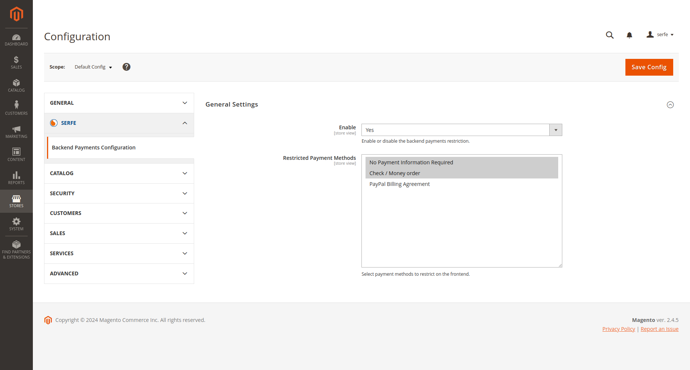

# Magento 2 Admin Only Payment Methods Module

[](https://packagist.org/packages/serfe/magento2-admin-only-payments-methods)
[](https://packagist.org/packages/serfe/magento2-admin-only-payments-methods)
[](https://packagist.org/packages/serfe/magento2-admin-only-payments-methods)

Enhance your Magento 2 store's payment management with the **Admin Only Payment Methods** module. This powerful extension allows you to configure specific payment methods that are exclusively available in the backend interface, ensuring that your store owners can process transactions without exposing these options to frontend customers.

## Key Features

- **Restrict Payment Methods**: Define which payment methods are accessible solely through the admin panel.
- **Enhanced Security**: Keep sensitive payment options hidden from customers, reducing potential fraud risks.
- **Store View Level Management**: Configure payment methods individually for different store views, providing flexibility in your payment strategy.

## Installation Guide

To install the **Admin Only Payment Methods** module, follow these steps:

1. **Require the Module**:
   Run the following command in your terminal:

   ```bash
   composer require serfe/magento2-admin-only-payments-methods
   ```

2. **Update and Compile**:
   After installation, make sure to execute the following commands to complete the setup:

   ```bash
   magento setup:update
   magento setup:di:compile
   magento setup:static-content:deploy
   magento cache:clean
   ```

## Configuration Instructions

Once the module is installed and enabled, configure it through the Magento backend:

1. Navigate to the configuration section:
   - **Backend** > **Stores** > **Configuration** > **Serfe** > **Backend Payments Configuration**

2. In the **General Settings**, you'll find the following options:

   

   - **Enable**: Toggle this option to enable or disable the module.
   - **Restricted Payment Methods**: Select from the available payment methods. The methods you choose here will be restricted to backend use only and will not be visible to customers on the frontend.

### Store View Level Management

This setting can be customized for each store view, allowing you to manage payment options effectively across your different storefronts.

## Conclusion

The **Magento 2 Admin Only Payment Methods** module provides an essential solution for Magento store owners who want to control payment methods strictly through the backend. Improve your store's payment security and management today!


## About Us

[Serfe](https://www.serfe.com/?utm_medium=referral_profile&utm_source=github&utm_campaign=115959) develops complete e-commerce solutions based on Magento 2 system and other platforms. Feel free to check it on the website.

### Contributing

We welcome any contribution to this module. Fork the repo, make your changes and create a pull request with your changes.